Stock Forecast
==============

A dynamic stock forecasting report.

.. contents:: Table of Contents

The report displays:

* The quantities currently reserved and available in stock in the selected stock locations.
* The planned stock moves for the following days / weeks / months.

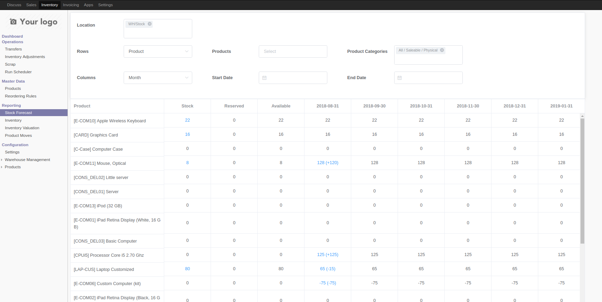

Behavior
--------
When clicking on a blue amount, the detail that composes this amount is displayed.

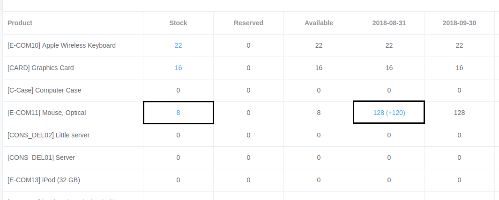

Here above, when clicking on the amount in stock `8`, the list of Quants is displayed:

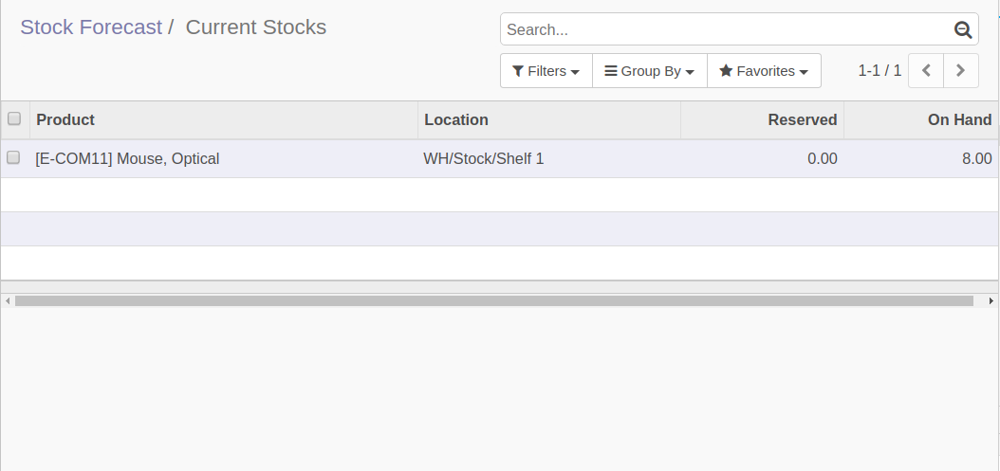

When clicking on the amount for a given month `128 (+120)`, the list of stock moves is displayed:

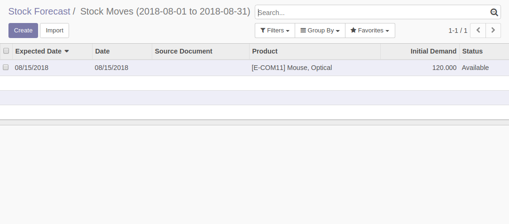

Filters
-------
Available filters include `Locations`, `Products`, `Product Categories`, `Start Date` and `End Date`.
When changing the selected filters, the table is automatically updated.

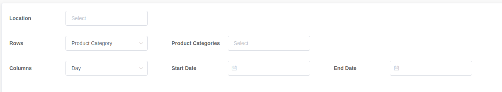

Supplier Filter
~~~~~~~~~~~~~~~
It is also possible to filter by the list of suppliers of products.

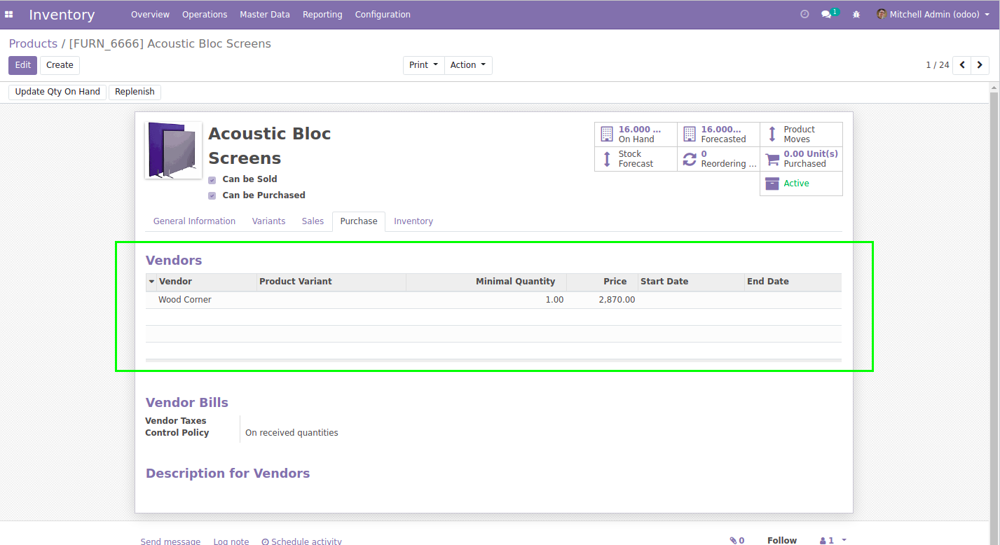

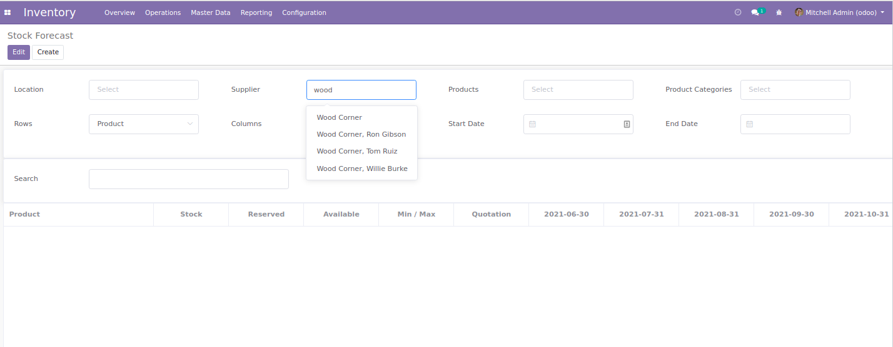

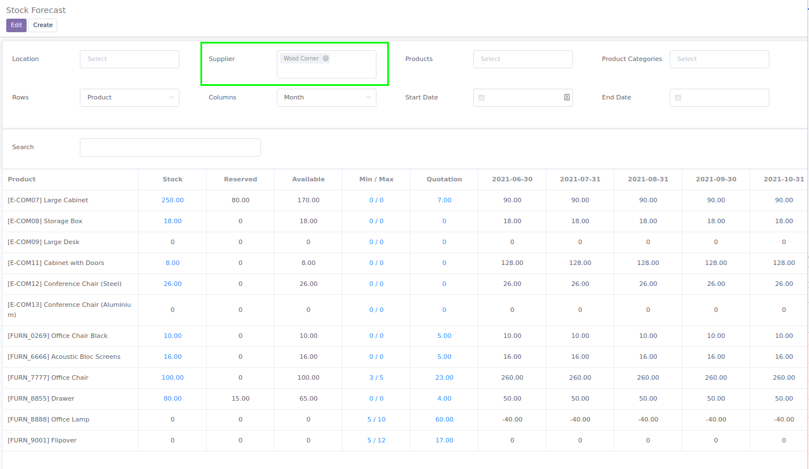

By default, the module show all products that have at least one price entry for the selected supplier.

The module ``vue_stock_forecast_preferred_supplier`` defines an alternative behavior.
See the module's README for more info.

Grouping Rows
-------------
The rows can be grouped by `Product` or `Product Category`.

When grouping by categories, all children category are also displayed in the table.

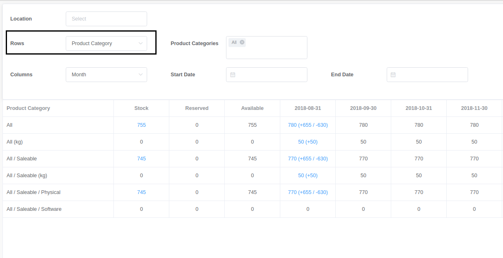

Grouping Columns
----------------
The columns can be grouped by `Day`, `Week` or `Month`.

By default 6 columns of stock moves are displayed.
By selecting specific `Start Date` and `End Date`, you can see more columns.

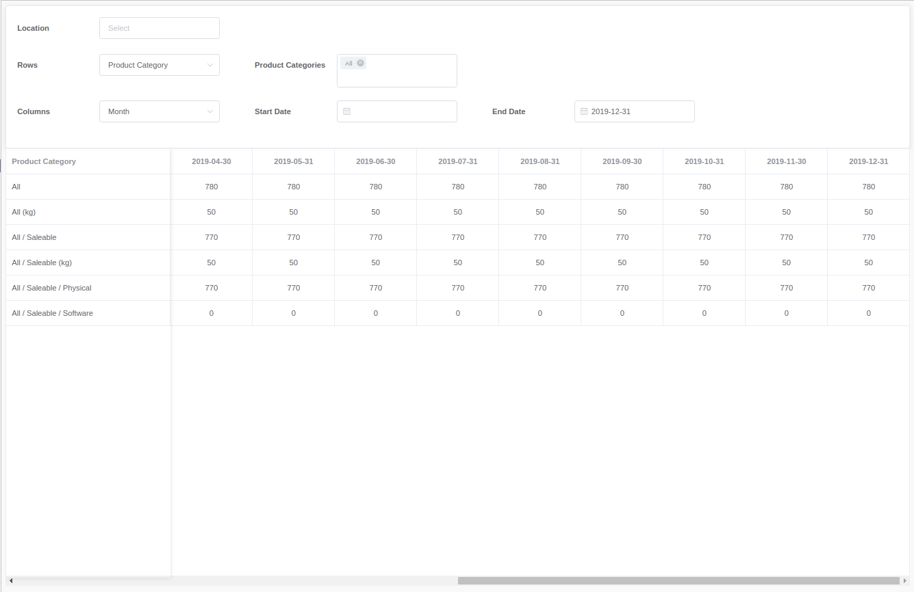

Min / Max
---------
Since version 1.2.0 of the module, the report shows the aggregated sum of reordering rules (Min / Max).

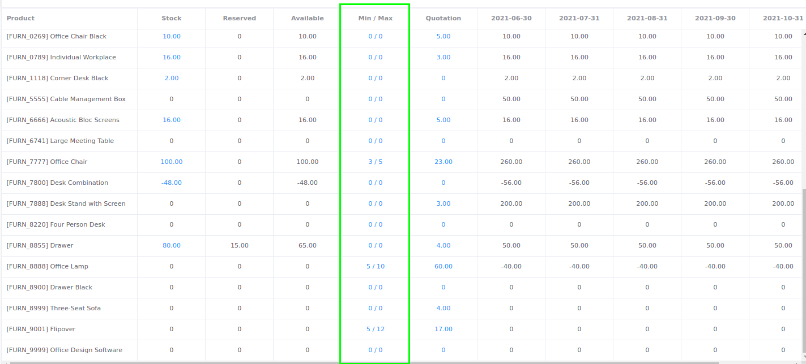

By clicking on the number, the list of reordering rules for this product is displayed.

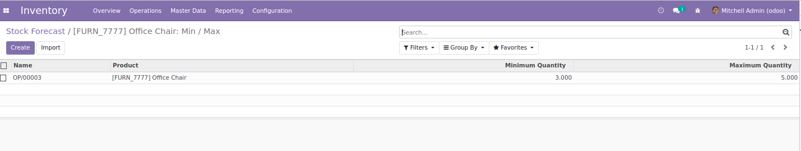

Purchase Quotations
-------------------
Since version 1.2.0 of the module, the report shows the quantities in draft (or sent) purchase quotations.

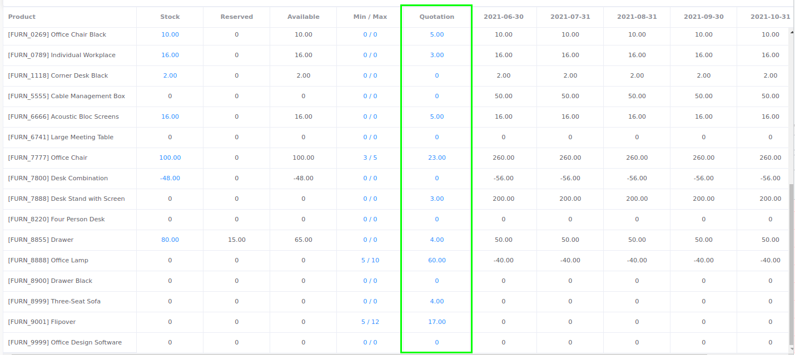

By clicking on the number, the list of purchase order lines for this product is displayed.

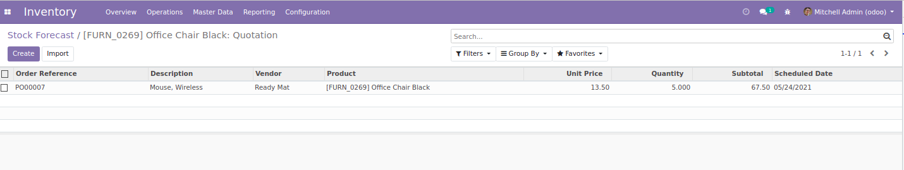

Search Bar
----------
Since version 1.2.0 of the module, a new search bar is available to filter the report lines.

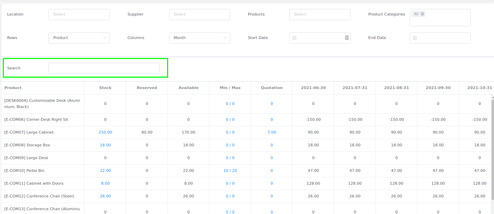

When typing in the search bar, the lines are filtered in real-time.

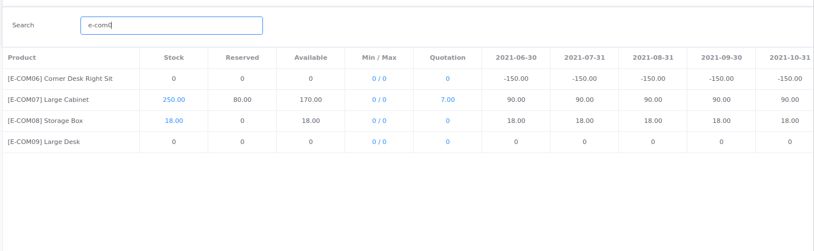

Product Smart Button
--------------------
A smart button is added on the form view of products in order to show the report.

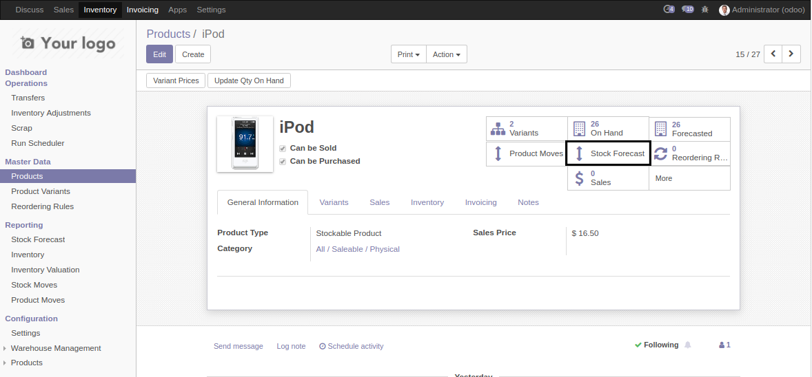

When accessing the report from a product template with multiple variants, the report is displayed for all variants.

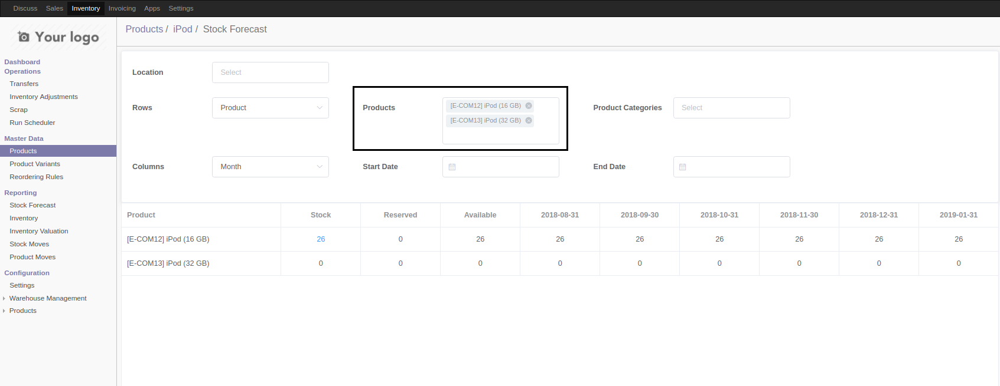

Purchase Order Smart Button
---------------------------
Since version 1.3.0 of the module, a smart button is also available from a purchase order.

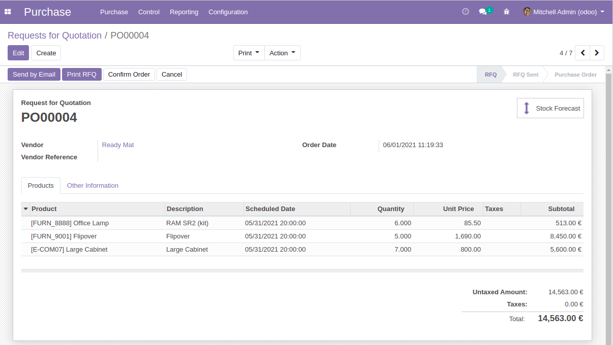

When I click on the button, the report is opened with the products contained in the purchase order.

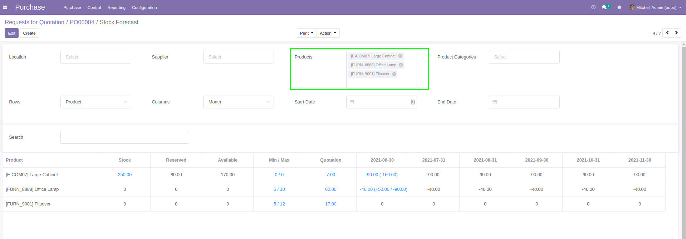

Contributors
------------
* Numigi (tm) and all its contributors (https://bit.ly/numigiens)

More information
----------------

* Meet us at https://bit.ly/numigi-com
