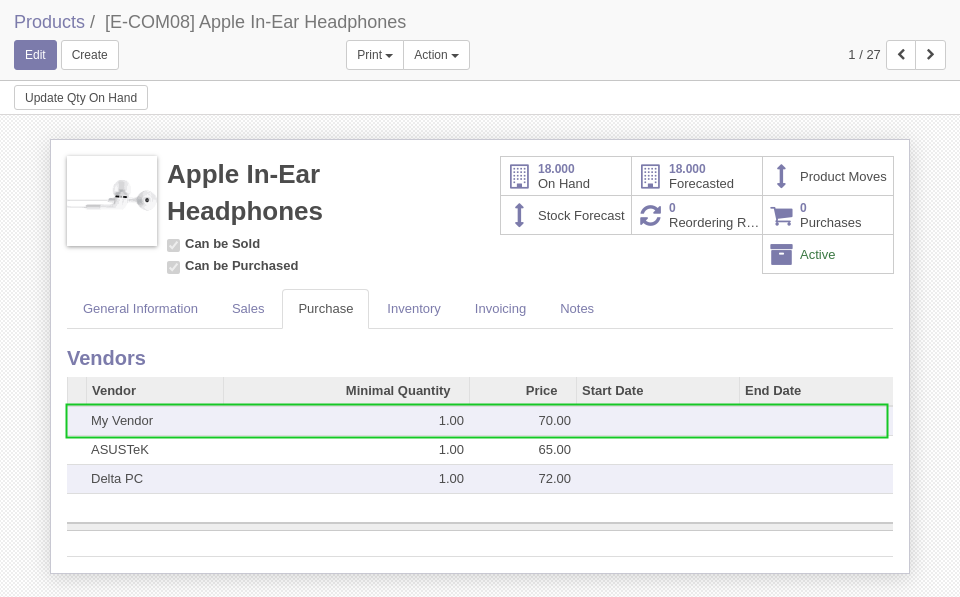
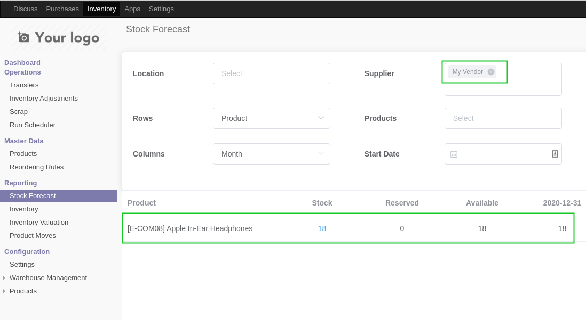

Stock Forecast - Preferred Supplier
===================================

This module extends ``vue_stock_forecast``.

Context
-------
A preferred supplier is the first supplier in the list of prices of a product.

Overview
--------
When filtering the report by supplier, it only shows products for which
the supplier is the preferred supplier.

Without this module, all products containing at least one price with the selected
supplier are shown.

Contributors
------------

The `Numigi <https://numigi.com/r/home>`_ team is the contributor to this project. We help Quebec companies implement Odoo and Konvergo ERP.